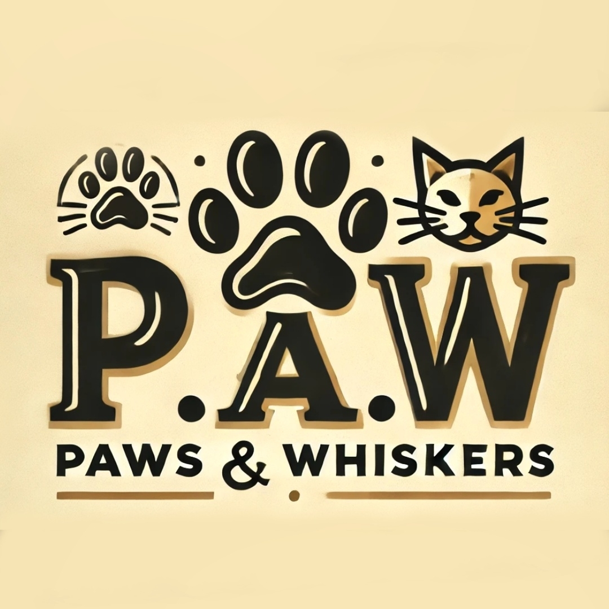

# P.A.W-Paws-Whiskers-
# CLUMZY-CODERZZ
## Open Source Programs
<p align="center"> P.A.W is ready for HackIndia Hackathon</p>
 <a href="https://hackindia.xyz//">
 
 </a>

<p align="center">Tech Stack:</p>
<p align="center">
     
    
    
    
</p>
<br>
<h1 align="center">P.A.W</h1>
<h3 align="center">"Bringing Hearts and Paws Together"</h3>
<p align="center">
  
  </p>

<p align="center"> Don't forget to follow my <a href="https://github.com/SHIVANSH2208">Github Profile</a> for discussions and updates. </p>


## Inspiration for the Project:

Our project was deeply inspired by our team's shared passion for animals and our commitment to animal welfare. Shalini Sahu, who has been providing shelter to numerous cats for the past few years, and Shivansh Tiwari, who is dedicated to helping and feeding street animals, brought their love and dedication to this initiative. We realized that while many people are eager to adopt and care for pets, the process can be cumbersome and inaccessible. Additionally, we noticed the absence of a reliable platform for emergency pet care and a central hub for pet-related news and community stories.

This inspired us to create a comprehensive platform that not only streamlines pet adoption and donation but also offers vital resources, such as emergency care connections and engaging content. By integrating features like dark/light mode and multi-language support, we aimed to make the platform as inclusive and user-friendly as possible. Our mission is to support responsible pet ownership and foster a stronger, more connected pet-loving community.


## Features of P.A.W at a Glance

<a href="https://github.com/SHIVANSH2208/P.A.W-Paws-and-Whiskers"><p align="center">The test site for the project can be found here.</p></a>


| Function | Feature | Image |
| --- | ----------- | -------|
| Adopting a Pet | Allows user to choose an animal they wish to adopt and submit their details for contact purposes |   |
| Donating a Pet | Pet owners can donate their pets if they are unable to take care of the ones they have |  |
| Emergency care for Stray Animals | Provide contact details to get emergency medical services |  |
| Support P.A.W | Allows users to become volunteers for P.A.W and submit their details for contact purposes |  |
| Pet News | P.A.W provides users with several stories on the latest news in the pet world |  |
| Blogs | P.A.W also has a blogs section dedicated to pet lovers and their pet stories |  |
----


Additional features:
- All the data is stored in the database so when a person wishes to adopt or donate an animal, their information will be auto-filled using the database. 
- The language of the website can also be translated to different languages by using the Google Translate button in the top right corner of the header.
- Users can click on the moon/sun button in the top right corner of the header to switch between light and dark mode for the website.
- Users can use the `Contact` page to drop in their details for a call with one of the team members. 
- Users can subscribe to P.A.W's newsletter to get the latest news and updates by entering their email in the subscription box located in the footer of every page. 
- There is a help button located in the bottom right corner of the `SOS Report` page that allows users to enter their city and find the nearest pet care centers.
- Users can find the organization's social media accounts in the bottom right corner of the footer of every page.


## View our Website:

Click the image below to view our website!

[](https://github.com/SHIVANSH2208/P.A.W-Paws-and-Whiskers/)

## Accomplishments:

We are proud to build a website where pet lovers can easily adopt animals that need a home. They can not only provide medical assistance to them but can also allow their fellow comrades in the community to adopt them.

## What's next for P.A.W 📲

In future, we plan to scale this application to reach as many people as possible and facilitate adoption and donation of animals.

Furthermore, we plan to connect with the nearest government organization that provides medical assistance to stray animals.

---

## ⭐ How to get started with open source?


You can refer to the following articles on the basics of Git and Github.

- [Watch this video to get started, if you have no clue about open source](https://youtu.be/SYtPC9tHYyQ)
- [Forking a Repo](https://help.github.com/en/github/getting-started-with-github/fork-a-repo)
- [Cloning a Repo](https://help.github.com/en/desktop/contributing-to-projects/creating-a-pull-request)
- [How to create a Pull Request](https://opensource.com/article/19/7/create-pull-request-github)
- [Getting started with Git and GitHub](https://towardsdatascience.com/getting-started-with-git-and-github-6fcd0f2d4ac6)

## Contributing 👨‍💻 

### 💥 How to contribute
- Take a look at the existing [Issues](https://github.com/SHIVANSH2208/P.A.W-Paws-and-Whiskers/issues) or [create a new issue](https://github.com/SHIVANSH2208/P.A.W-Paws-and-Whiskers/issues/new/choose)!
- [Fork the Repo](https://github.com/SHIVANSH2208/P.A.W-Paws-and-Whiskers/fork). Then, create a branch for any issue that you are working on. Finally, commit your work.
- Create a **[Pull Request](https://github.com/SHIVANSH2208/P.A.W-Paws-and-Whiskers/compare)** (_PR_), which will be promptly reviewed and given suggestions for improvements by the community.
- Add screenshots or screen captures to your Pull Request to help us understand the effects of the changes proposed in your PR.
- **DON'T CREATE PRs WITHOUT CREATING ISSUE AND GETTING ASSIGNED**

### ⭐ How to make a pull request (PR)
**1.** Start by making a Fork of the [**P.A.W**](https://github.com/SHIVANSH2208/P.A.W-Paws-and-Whiskers/) repository. Click on the <a href="https://github.com/SHIVANSH2208/P.A.W-Paws-and-Whiskers/fork"></a>Fork symbol at the top right corner.

**2.** Clone your new fork of the repository in the terminal/CLI on your computer with the following command:

```bash
git clone https://github.com/<your-github-username>/P.A.W-Paws-and-Whiskers
```

**3.** Navigate to the newly created P.A.W-Paws-and-Whiskers project directory:

```bash
cd P.A.W-Paws-and-Whiskers
```

**4.** Set upstream command:

```bash
git remote add upstream https://github.com/SHALINISAHU-08/P.A.W-Paws-and-Whiskers.git
```

**5.** Create a new branch:

```bash
git checkout -b YourBranchName
```

**6.** Sync your fork or your local repository with the origin repository:

- In your forked repository, click on "Fetch upstream"
- Click "Fetch and merge"

**7.** Make your changes to the source code.

**8.** Stage your changes and commit:

⚠️ **Make sure** not to commit `package.json` or `package-lock.json` file

⚠️ **Make sure** not to run the commands `git add .` or `git add *`. Instead, stage your changes for each file/folder

```bash
git add public
```

```bash
git commit -m "<your_commit_message>"
```

**9.** Push your local commits to the remote repository:

```bash
git push origin YourBranchName
```

**10.** Create a [Pull Request](https://help.github.com/en/github/collaborating-with-issues-and-pull-requests/creating-a-pull-request)!

**11.** **Congratulations!** You've made your first contribution to [**P.A.W-Paws-and-Whiskers**](https://github.com/SHIVANSH2208/P.A.W-Paws-and-Whiskers/graphs/contributors)! 🙌🏼


## 😎 Project Maintainers

<table>
  <tr>
<td align="center"><a href="https://github.com/SHALINISAHU-08"><br /><sub><b>SHALINI SAHU</b></sub></a></td>

<td align="center"><a href="https://github.com/SHIVANSH2208"><br /><sub><b>SHIVANSH TIWARI</b></sub></a></td>
 

  
 </tr>
</table>

## License 🛡️ 

P.A.W is licensed under the MIT License - see the [LICENSE](https://github.com/SHIVANSH2208/P.A.W-Paws-and-Whiskers/blob/main/LICENSE) file for details.

## Socials 

[](https://github.com/SHIVANSH2208/P.A.W-Paws-and-Whiskers)
